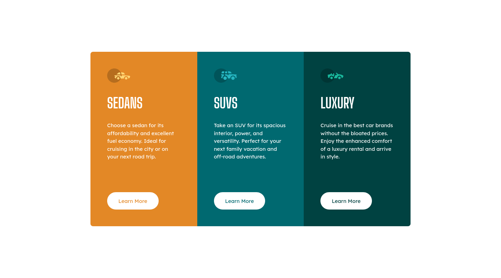

# Frontend Mentor - 3-column preview card component solution

This is a solution to the [3-column preview card component challenge on Frontend Mentor](https://www.frontendmentor.io/challenges/3column-preview-card-component-pH92eAR2-). Frontend Mentor challenges help you improve your coding skills by building realistic projects.

## Table of contents

- [Frontend Mentor - 3-column preview card component solution](#frontend-mentor---3-column-preview-card-component-solution)
  - [Table of contents](#table-of-contents)
  - [Overview](#overview)
    - [The challenge](#the-challenge)
    - [Screenshot](#screenshot)
    - [Links](#links)
  - [My process](#my-process)
    - [Built with](#built-with)
    - [What I learned](#what-i-learned)
  - [Author](#author)

## Overview

### The challenge

Users should be able to:

- View the optimal layout depending on their device's screen size
- See hover states for interactive elements

### Screenshot



### Links

- Solution URL: [https://github.com/dieudonneallognon/3-column-preview-card-component](https://github.com/dieudonneallognon/3-column-preview-card-component)
- Live Site URL: [https://dieudonneallognon.github.io/3-column-preview-card-component/](https://dieudonneallognon.github.io/3-column-preview-card-component/)

## My process

### Built with

- Semantic HTML5 markup
- Flexbox
- CSS Grid
- Desktop-first workflow
- Less

### What I learned

For this project, I used some css animations for active states.

```css

a {
  &:hover {
    ...
    transition: all 0.25s ease-in;
  }
}

```

## Author

- Github - [dieudonneallognon](https://github.com/dieudonneallognon)
- LinkedIn - [Dieudonné Allognon](https://www.linkedin.com/in/dieudonn%C3%A9-allognon-200239175/)
- Frontend Mentor - [@dieudonneallognon](https://www.frontendmentor.io/profile/dieudonneallognon)
- Twitter - [@JieDevM](https://twitter.com/JieDevM)
